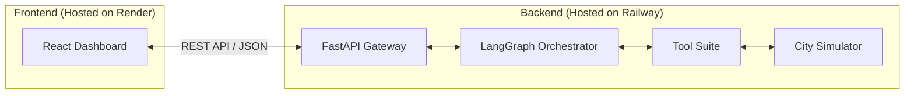

#  Urban Crisis Response Agent
**Autonomous Real-time Urban Crisis Response & Resource Orchestrator**

A professional agentic system designed for the **Agentic AI Hackathon (Tech Zephyr 4.0 | IIT Bhubaneswar)**. This project demonstrates how an autonomous agent can manage a complex, evolving urban disaster scenario by interacting with a real-time simulator using a cyclic state-machine architecture.

##  System Architecture

The project is decoupled into a **Frontend (React)** and a **Backend (FastAPI)** to allow for professional cloud deployment.



### Core Components
- **Frontend**: A React-based dashboard for real-time visualization of the city map, agent reasoning logs, and crisis control.
- **Backend API**: A FastAPI server that exposes the simulator and agent as a set of endpoints.
- **Agentic Brain**: Powered by **LangGraph** and **Claude 3.5 Sonnet (via OpenRouter)**, implementing a professional cyclic loop:
  `Observe` $\rightarrow$ `Plan` $\rightarrow$ `Execute` $\rightarrow$ `Evaluate` $\rightarrow$ `Observe`.

---

##  Getting Started

### Prerequisites
- Python 3.10+
- Node.js & npm (for frontend)
- `uv` installed (`pip install uv`)
- An OpenRouter API Key

### Installation & Setup

#### 1. Backend Setup (Railway)
```bash
cd backend
# Install dependencies
uv pip install -r ../requirements.txt
# Create .env file
echo "OPENROUTER_API_KEY=your_key" > .env
# Run the API
uv run python main.py
```

#### 2. Frontend Setup (Render)
```bash
cd frontend
npm install
npm start
```

---

##  Project Documentation

Detailed specifications are available in the `docs/` folder:

- [**Problem Statement**](docs/problem_statement.md): Challenge overview and success criteria.
- [**System Design**](docs/design.md): Decoupled architecture and LangGraph workflow.
- [**Implementation Roadmap**](docs/roadmap.md): Phased approach to building the system.
- [**Presentation Outline**](docs/presentation_outline.md): Blueprint for the final presentation.

---

##  Deployment Guide

### Backend (Railway.app)
1. Connect your GitHub repo to Railway.
2. Set the root directory to `/backend`.
3. Add `OPENROUTER_API_KEY` as an environment variable.
4. Use the start command: `uv run python main.py`.

### Frontend (Render.com)
1. Connect your GitHub repo to Render.
2. Set the root directory to `/frontend`.
3. Build command: `npm run build`.
4. Publish directory: `build`.
5. Set an environment variable `REACT_APP_API_URL` pointing to your Railway URL.

---

##  License
This project is developed for the Tech Zephyr 4.0 Agentic AI Hackathon.
