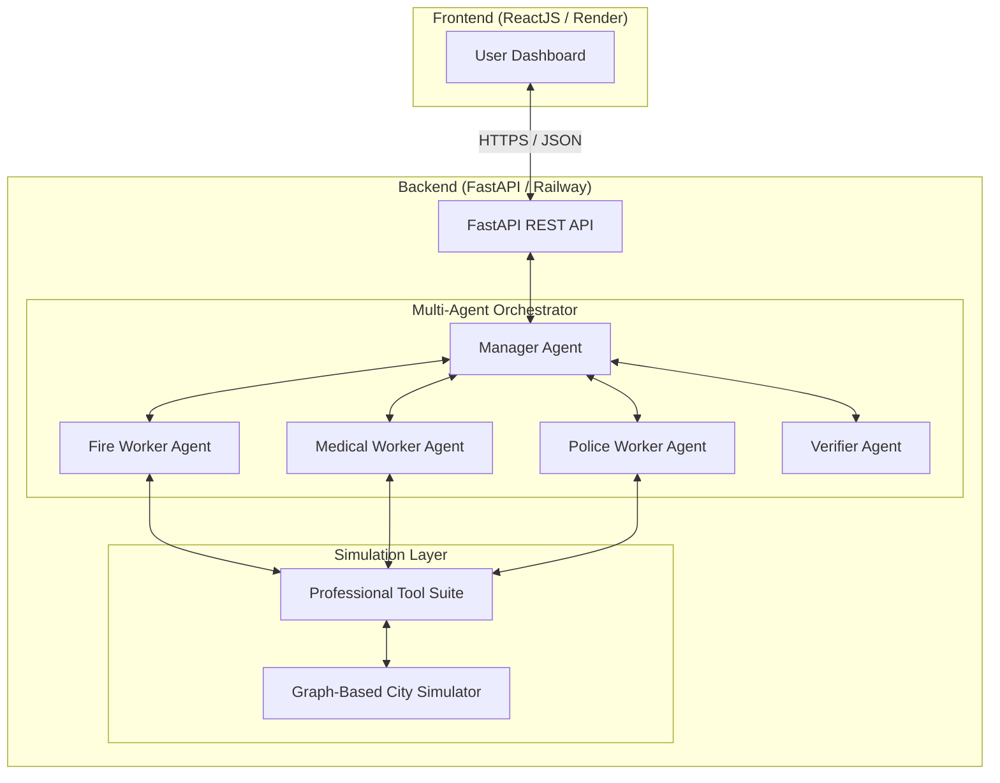
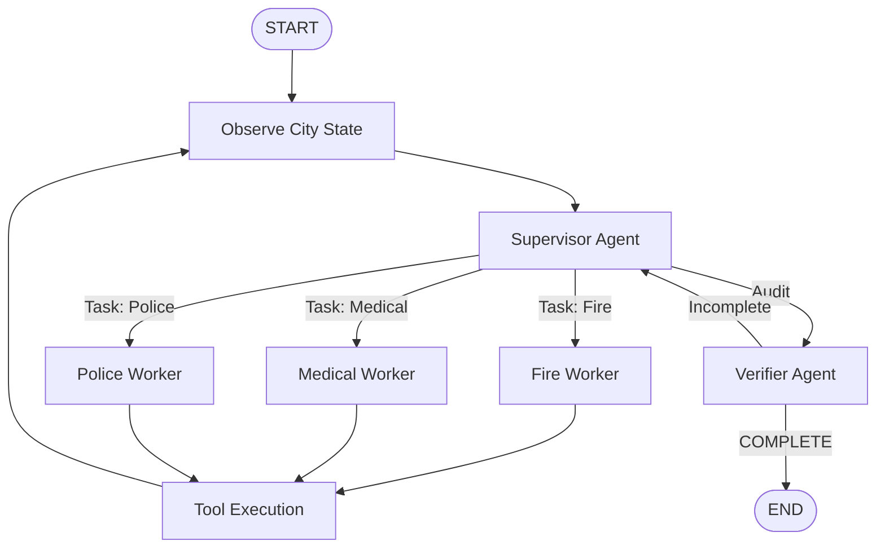

# System Design: Professional Urban Crisis Response Agent

## 1. High-Level Architecture
The system is a decoupled **Client-Server architecture** designed for high-fidelity simulation and autonomous multi-agent orchestration.

### Component Breakdown
- **Frontend**: A React-based dashboard using **Lucide Vector Icons** and a real-time city grid.
- **Backend**: A FastAPI server providing a RESTful gateway to the agentic core.
- **Agentic Core**: Implements a **Multi-Agent Supervisor Pattern** using **LangGraph** and **Claude 3.5 Sonnet**.
- **Simulation Layer**: A **Graph-based Simulator** using **Dijkstra's Algorithm** for shortest-path routing and real-time obstacle avoidance.

## 2. The Multi-Agent Workflow

The system uses a hierarchical orchestration pattern to maximize specialization and verification.

- **Supervisor Agent**: The "Brain." Analyzes the crisis, prioritizes objectives, and delegates tasks to the correct specialist.
- **Specialized Workers**: Agents dedicated to one domain. They utilize tools to dispatch units and monitor their specific goals.
- **Verifier Agent**: The "Auditor." Performs a final check of the operations to ensure efficiency and resolution before closing the case.

## 3. Technical Innovations

### Graph-Based Routing
Unlike simple coordinate movement, the simulator now uses a **weighted graph**.
- **Dijkstra's Algorithm**: Units calculate the mathematically shortest path to the incident.
- **Dynamic Rerouting**: If a road is blocked during transit, the agent detects the failure and triggers a real-time path recalculation.

### State-Machine Orchestration
Using **LangGraph**, the agent maintains a persistent, shared state that allows:
- **Cyclic Reasoning**: Continuous observation $\rightarrow$ planning $\rightarrow$ execution.
- **Hierarchical Delegation**: Complex problems are broken down into specialized tasks.
- **Closed-Loop Verification**: No case is closed without an independent audit by the Verifier agent.

## 4. Tool Definitions
| Tool | Input | Output | Description |
|---|---|---|---|
| `get_city_state` | None | JSON State | Current alerts, unit paths, and road statuses. |
| `dispatch_unit` | `unit_id`, `target_id` | Success/Fail | Calculates shortest path and assigns resource. |
| `block_road` | `road_id` | Success/Fail | Simulates real-world disruption. |
| `add_emergency` | `type`, `loc`, `pri` | Incident ID | Injects a new crisis into the graph. |
