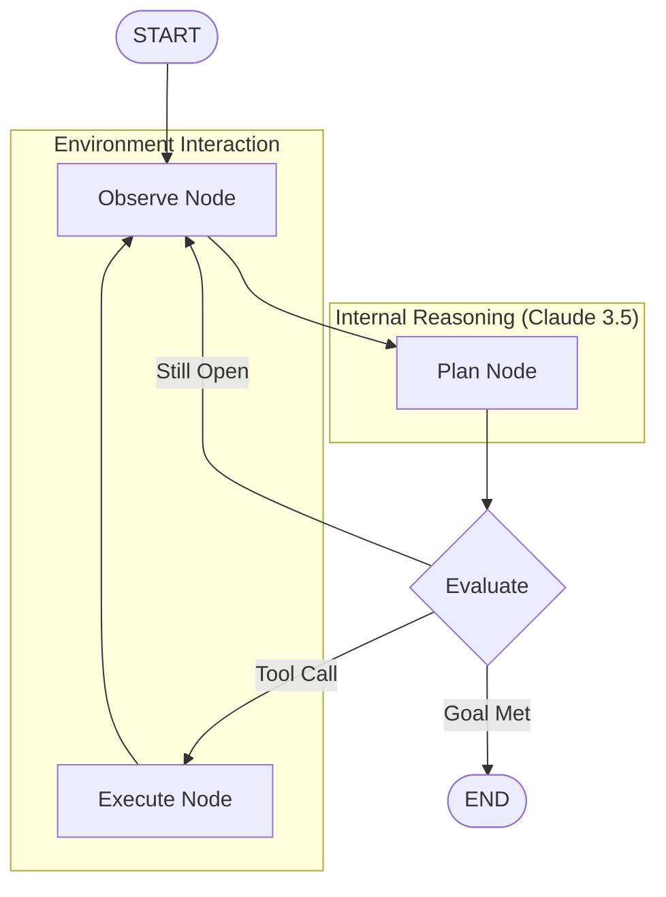

# System Design: Urban Crisis Response Agent

## 1. High-Level Architecture
The system is built using a cyclic state-machine architecture powered by **LangGraph** and **Claude 3.5 Sonnet (via OpenRouter)**.

- **The City Simulator**: A background process that generates a stream of events and maintains the "ground truth" of the city (road status, unit positions).
- **The Agentic Orchestrator (LangGraph)**: A directed cyclic graph (DCG) that manages the agent's state and determines the next action based on observations.
- **The Tool Suite**: A set of LangChain-compatible tools that allow the agent to interact with the simulator.

## 2. The Agentic Loop (LangGraph Workflow)

The agent follows a professional cyclic graph designed for maximum autonomy and error recovery.

- **Observe Node**: Ingests the latest city state and adds it to the conversation history as a HumanMessage.
- **Plan Node**: Claude 3.5 Sonnet analyzes the state and decides which tools to call (e.g., `dispatch_unit`).
- **Execute Node (ToolNode)**: Executes the tool calls against the simulator and returns the results as ToolMessages.
- **Evaluate Node**: A conditional edge that checks:
    - If tool calls were made $\rightarrow$ Go to `Execute`.
    - If incidents are still open $\rightarrow$ Loop back to `Observe`.
    - If all goals are met $\rightarrow$ `END`.

## 3. Tool Definitions
| Tool | Input | Output | Description |
|---|---|---|---|
| `get_city_state` | None | JSON State | Current alerts, active units, and road statuses. |
| `dispatch_unit` | `unit_id`, `target_id` | Success/Fail | Assigns a resource to an emergency. |
| `block_road` | `road_id` | Success/Fail | Simulates a road blockage for testing adaptation. |
| `add_emergency` | `type`, `loc`, `pri` | Incident ID | Adds a new emergency incident to the city. |

## 4. Data Model
- **Incident**: `{id, type, location, priority, status (open/resolved), timestamp}`
- **Resource**: `{id, type (Fire/Med/Police), location, status (idle/busy/broken)}`
- **Road**: `{id, from, to, status (open/blocked)}`

## 5. Failure Scenarios for Demo
To win the competition, we simulate:
1. **Priority Shift**: A Critical incident appears while managing Low-priority ones.
2. **Real-time Adaptation**: A unit is dispatched $\rightarrow$ a road on its path is blocked $\rightarrow$ the agent detects the failure and reroutes.
3. **Resource Failure**: A unit becomes "Broken" $\rightarrow$ the agent re-assigns the mission.
