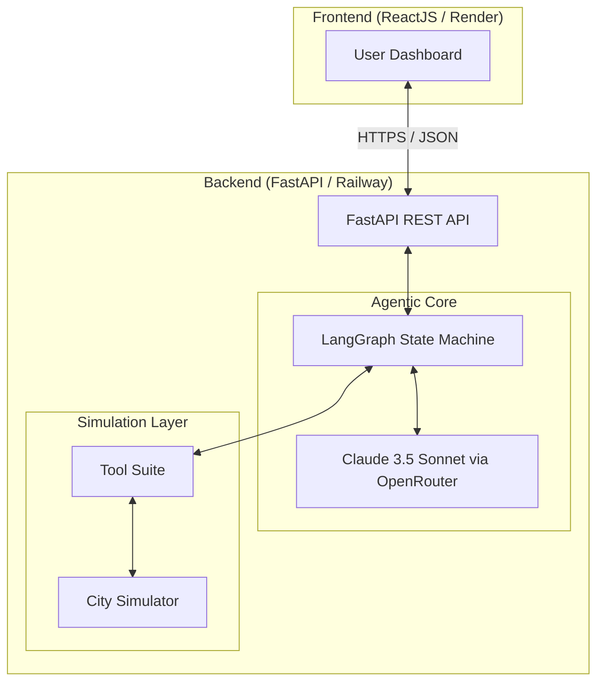
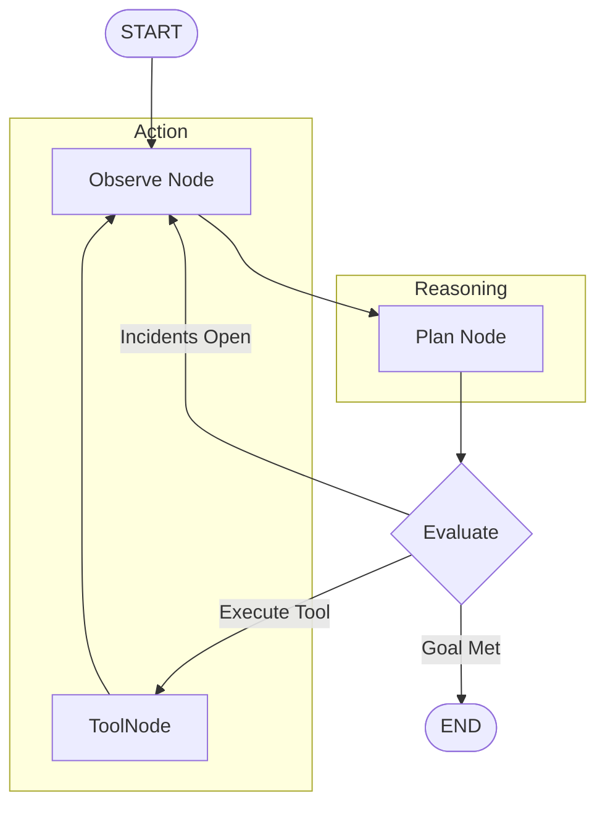

# System Design: Urban Crisis Response Agent

## 1. High-Level Architecture
The system is now designed as a decoupled **Client-Server architecture** to support professional cloud deployment.

### Component Breakdown
- **Frontend**: Handles the visual state of the city. It polls the `/state` endpoint to update the map and sends commands via `/emergency` and `/infrastructure`.
- **Backend Gateway**: A FastAPI server that handles CORS, request validation, and provides an interface to the agent.
- **Agentic Core**: Uses **LangGraph** to maintain a persistent state of the crisis and orchestrate actions.
- **Simulation Layer**: A high-fidelity Python simulator that tracks unit positions and road statuses in real-time.

## 2. The Agentic Loop (LangGraph Workflow)

The agent operates on a cyclic graph that ensures autonomy and error recovery.

- **Observe Node**: Fetches current city telemetry and adds it to the state.
- **Plan Node**: Claude 3.5 Sonnet reasons about the crisis and decides which tools to invoke.
- **Execute Node**: Performs the physical action in the simulator (e.g., dispatching a unit).
- **Evaluate Node**: Determines if the system needs to loop back to re-observe or if the crisis is resolved.

## 3. Tool Definitions
| Tool | Input | Output | Description |
|---|---|---|---|
| `get_city_state` | None | JSON State | Current alerts, active units, and road statuses. |
| `dispatch_unit` | `unit_id`, `target_id` | Success/Fail | Assigns a resource to an emergency. |
| `block_road` | `road_id` | Success/Fail | Simulates a road blockage for testing adaptation. |
| `add_emergency` | `type`, `loc`, `pri` | Incident ID | Adds a new emergency incident to the city. |

## 4. Data Model
- **Incident**: `{id, type, location, priority, status, timestamp}`
- **Resource**: `{id, type, location, status, assigned_incident}`
- **Road**: `{id, start, end, status}`

## 5. Deployment Strategy
- **Frontend**: Static site hosting on **Render**.
- **Backend**: Containerized Python app on **Railway**.
- **API**: RESTful communication over HTTPS with CORS enabled.
